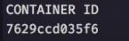

# CRIANDO MEU PRIMEIRO CONTAINER

-  Passo 1º\
  Criamos um servidor simples "index.js".

- Passo 2º\
  Instalamos dependencias, no caso rodar
  *npm install express*
  
- Passo 3º\
  Previamente instalado o Docker na nossa máquina, criamos um arquivo **Dockerfile** onde iremos colocar os comandos para subir a nossa aplicação.

- Passo 4º\
  Criamos o arquivo **.dockerignore** e colocamos dentro, quais arquivos o docker deve ignorar. Neste caso queremos ignorar o *node_modules*.

- Passo 5º\
  Propriedade CMD deve ser única por Dockerfile, e basicamente é o que dirá ao nosso Docker qual comando executar pra rodar nossa aplicação.

  Para isso, devemos ir ao nosso **package.json** e acrescentar uma linha.

  

## HORA DO TESTE
- Passo 6º\
  Rodar  *docker build -t ramirezmz/based-docker .*, dessa forma montaremos a imagem.

- Passo 7º\
  Rodar *docker run -p 3000:3000 -d ramirezmz/based-docker*

  E pronto!
  Temos basicamente o nosso container rodando.

## USANDO [NODEMON](https://github.com/remy/nodemon)

Em poucas palavras, o nodemon é uma ferramenta que nos ajuda a atualizar automanticamente cada alteração que façamos em nossa aplicação.

- Passo 8º\
  Estaremos criando mais um arquivo.
  
  
  Ele que dará as informações de como nosso container irá se comportar.

- Passo 9º\
  Instalar o nodemon, *npm install nodemon*

- Passo 10º\
  Devemos modificar uma linha de nosso arquivo *package.json*

  

- Passo 11º\
  Antes de rodar nosso docker com um comando só, devemos encerrar o anterior, digitando *docker stop CONTAINERID*

  OBS. Substituir CONTAINER ID pelo número, como embaixo.

  

- Passo 12º\

Finalmente, podemos rodar nosso container com um comando!\
*docker-compose up*
ou *docker-compose up -d* para rodar em segundo plano pelo terminal.

  ### COMANDOS DOCKER USADOS:
  - docker -v
  - docker-compose -v
  - docker build -t username/node-web-app .
  - docker run -p 3000:3000 -d username/node-web-app
  - docker stop CONTAINERID
  - docker-compose up